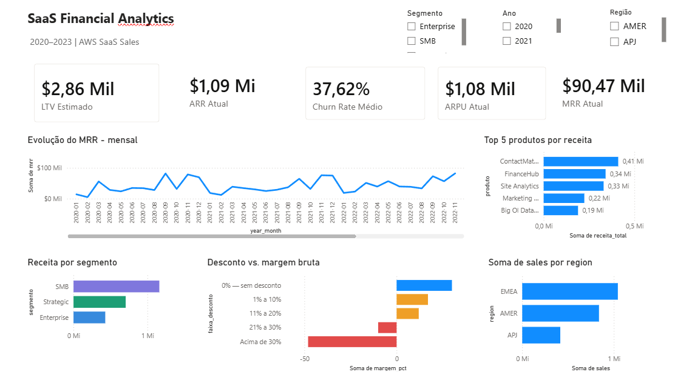

# SaaS Sales Analytics

Pipeline de dados que le um dataset de vendas do Kaggle, limpa e carrega os dados em um banco PostgreSQL, calcula KPIs de SaaS (MRR, ARR, ARPU, Churn Rate, LTV) e gera consultas SQL analiticas e graficos para acompanhamento de receita.

Projeto feito para praticar o fluxo completo de um pipeline de dados: ETL em Python, modelagem de banco relacional, SQL analitico com window functions e visualizacao de resultados.

## Sobre os dados

O dataset de origem e uma variacao do "Superstore" do Kaggle, com os nomes de produto adaptados para parecer um catalogo de SaaS (Marketing Suite, FinanceHub, ContactMatcher, etc). Isso significa que os dados representam pedidos avulsos de um varejo B2B, nao assinaturas recorrentes reais.

Isso importa porque o calculo de churn deste projeto usa como proxy "o cliente comprou no mes T e nao comprou no mes T+1". Em compras avulsas e esporadicas esse proxy superestima bastante o churn real: rodando o pipeline com os dados atuais, a taxa de churn mensal fica em torno de 37%, o que seria um numero absurdo para uma empresa de SaaS de verdade, mas e coerente com o padrao de compra do dataset. O codigo em `analises.py` documenta essa limitacao nos comentarios da funcao `calcular_churn`. Em um cenario real, churn deveria ser medido a partir de eventos de cancelamento de contrato, nao de intervalo entre pedidos.

O ARR tambem e uma simplificacao: o projeto trata toda a receita do mes como recorrente e multiplica por 12. Em SaaS de verdade, ARR conta apenas contratos anuais recorrentes.

## Estrutura do projeto

```
schema.sql        cria a tabela vendas, indices e a view vw_receita_mensal
etl.py             le o CSV bruto, limpa os dados e carrega no PostgreSQL
analises.py        calcula os KPIs em pandas e gera os graficos
consultas.py       roda as consultas SQL analiticas direto no banco
data/raw/          CSV bruto do Kaggle (nao versionado, ver .gitignore)
data/processed/    CSVs limpos e resultados das analises
docs/plots/        graficos gerados por analises.py
docs/powerbi/      dashboard .pbix e prints do Power BI
logs/              logs de execucao de cada script
```

## KPIs calculados

- MRR (Monthly Recurring Revenue): soma das vendas no mes
- ARR (Annual Recurring Revenue): MRR multiplicado por 12
- ARPU (Average Revenue Per User): MRR dividido pelo numero de clientes ativos no mes
- Churn Rate: percentual de clientes que compraram no mes T e nao compraram em T+1
- LTV (Lifetime Value): ARPU dividido pela taxa de churn mensal

## Como rodar

### Pre requisitos

- Python 3.10 ou superior
- PostgreSQL rodando localmente ou em nuvem
- Bibliotecas listadas em `requirements.txt`, instaladas com:
  ```
  pip install -r requirements.txt
  ```

### Configuracao

Copie `.env.example` para `.env` e preencha com as credenciais do seu banco:

```
DB_HOST=localhost
DB_PORT=5432
DB_NAME=saas_analytics
DB_USER=postgres
DB_PASSWORD=sua_senha
```

Baixe o dataset original do Kaggle e salve como `data/raw/saas_bruto.csv`.

### Execucao

1. Crie o banco e aplique o schema:
   ```
   psql -U postgres -c "CREATE DATABASE saas_analytics"
   psql -U postgres -d saas_analytics -f schema.sql
   ```

2. Rode o ETL para limpar os dados e carregar no banco:
   ```
   python etl.py
   ```

3. Calcule os KPIs e gere os graficos:
   ```
   python analises.py
   ```

4. Rode as consultas SQL analiticas:
   ```
   python consultas.py
   ```

Cada script grava seu proprio log em `logs/` e os resultados (CSVs e graficos) ja ficam disponiveis em `data/processed/` e `docs/plots/` mesmo sem rodar o pipeline localmente.

## Consultas SQL analiticas

`consultas.py` roda seis consultas contra o banco, todas comentadas explicando a logica usada:

1. MRR mensal com crescimento mes a mes (window function LAG)
2. Receita e margem por segmento (window function aninhada para calcular share do total)
3. Top 10 produtos por receita (RANK)
4. Top 10 clientes por receita
5. Receita por trimestre
6. Impacto do desconto na margem bruta (CASE WHEN para faixas de desconto)

## Power BI

Dashboard construido a partir do banco PostgreSQL do projeto. O arquivo fonte esta em `docs/powerbi/dashboard.pbix`.



## Limitacoes conhecidas

- O churn e calculado por proxy de recompra, nao por cancelamento de contrato, o que infla a taxa em relacao a um cenario real de SaaS.
- O ARR e uma extrapolacao simples do MRR do mes, sem distinguir contratos anuais de vendas avulsas.
- O dataset cobre um numero relativamente pequeno de clientes (99), entao metricas mensais podem variar bastante de um mes para o outro.
